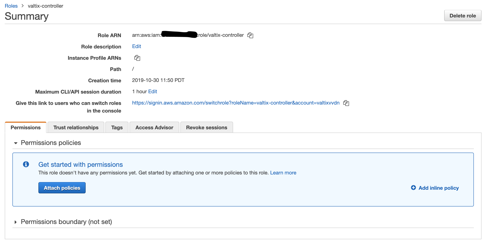

# Valtix Cloud Assessment Risk Report
Welcome to the Valtix trial that will provide network and application insights to your Public Cloud.  Below are the details to help guide you through the easy setup.  Before jumping to that, here are a few house-keeping areas:

* Initially, AWS is supported for North America based regions.  Azure is expected soon.
* The assessment will include up to 2 AWS VPCs with support for more as needed and upon request.
* Your trial will last for 14-days.  Valtix will provide the Valtix Cloud Assessment Risk Report based on 7-days of your data.
* Valtix will collect your data and generate a short and simple report that highlights:
    - Amount of encrypted traffic (bytes, sessions) - consider deep security inspection
    - Cloud inventory dynamism - identifies ‘top talkers’ such as instances, apps, tags, more
    - Traffic behavior - shows top/bottom ports used and what objects/tags they’re tied to.

Valtix security experts will walk you through the report, offer cloud security posture recommendations and get you to the next phase - a richer Valtix Security Platform experience to include the deployment of the Valtix Cloud Firewall.  This trial will give you ~30 days of full access to Discover (similar visibility), Deploy (get a firewall up and running in seconds) and Defend (configure your firewall with Valtix rich services - advanced firewall, IPS, WAF, TLS).

******************************************************************************************************************************

# Requirements
For Valtix to generate a risk report, you need to do the following:
1. Enable VPC Flow Logs for all the VPCs running your applications.
1. Create a cross acount IAM Role that can be used by the Valtix Controller to connect to your AWS environment.

# Enable VPC Flow Logs
1. Select the VPC(s) to be assessed

    

1. Create Flow Logs for your selected VPC with Filter **All** and Destination **Send to an S3 Bucket** with S3 Bucket ARN
as **arn:aws:s3:::ask-valtix-for-the-bucket-name**

     


# Create Cross-Account IAM Role
1. Create a new IAM Role with trusted entity as **Another AWS Account**, Account ID as **valtix-account-number** and add an external id as **ValtixCloudController**. (External ID can be anything that you wish to use)

    

1. Do not assign any permissions, a JSON policy is provided later in the document and the role will be edited to add this policy

1. Keep clicking next and provide a role name as **ValtixCloudController** and finish creating the role.

1. Select the role created above and in the Permissions tab click **Add inline policy** and select **JSON** in the policy editor

    

    

1. Copy the following policy in the editor

    ```
    {
        "Version": "2012-10-17",
        "Statement": [
            {
                "Action": "ec2:*",
                "Effect": "Allow",
                "Resource": "*"
            },
            {
                "Effect": "Allow",
                "Action": "elasticloadbalancing:*",
                "Resource": "*"
            }
        ]
    }
    ```

1. On the Valtix Cloud Controller, login with the username and password assigned to you, add AWS account with the IAM Role created above.
1. Once the account is added, click the 3 bars next to the account name and then **Inventory**, select all the regions and save. This enables the controller to start listening to the inventory changes in your account.
1. On your cloud account, create a new Trail under CloudTrail and log the events to any of your S3 buckets.
1. Go to **CloudWatch** > **Events** and add a new Rule
1. Select **Event Pattern** and choose **Build Custom Event Pattern**
1. Copy the following content
    ```
    {
      "source": [
        "aws.ec2",
        "aws.elasticloadbalancing",
        "aws.apigateway"
      ],
      "detail-type": [
        "AWS API Call via CloudTrail"
      ]
    }
    ```
1. **Add Target** and choose **Event bus in another AWS account** and add account id **valtix-account-number**
1. You can either create a new role or use an existing role that has permissions to publish events to the account specified above.
1. In the next page, add a rule name and click **Create Rule**
1. This configuration of the CloudWatch Event Rules enables inventory changes to be read by Valtix Cloud Controller and build inventory details.
